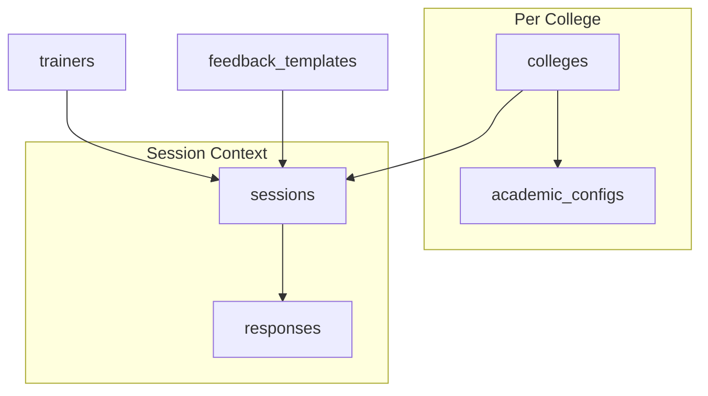

# Firebase Firestore Schema Documentation

This document outlines the complete Firestore database schema for the Trainer Feedback System.

---

## Collections Overview

| Collection | Document ID | Description |
|------------|-------------|-------------|
| `trainers` | Auto-generated | Trainer/Faculty profiles |
| `colleges` | Auto-generated | Organization/College entities |
| `sessions` | Auto-generated | Feedback session records |
| `feedback_templates` | Auto-generated | Reusable feedback form templates |
| `academic_configs` | `collegeId` | Academic structure per college |
| `sessions/{sessionId}/responses` | Auto-generated | Subcollection for feedback responses |

---

## `trainers` Collection

Stores trainer/faculty profiles registered in the system.

```js
{
  trainer_id: "TR001",           // Unique trainer identifier (business key)
  name: "John Doe",
  email: "john.doe@example.com",
  domain: "Computer Science",
  specialisation: "Machine Learning",
  topics: ["Python", "Deep Learning", "NLP"],  // Array of topics
  createdAt: Timestamp,          // Server timestamp
  updatedAt: Timestamp           // Server timestamp (on updates)
}
```

### Indexes
- `trainer_id` (for duplicate checking)

---

## `colleges` Collection

Stores organization/college entities.

```js
{
  name: "ABC Engineering College",
  code: "ABC-EC",                // Unique college code (business key)
  logoUrl: "https://...",        // Optional logo URL
  createdAt: Timestamp,
  updatedAt: Timestamp
}
```

### Indexes
- `code` (for duplicate checking)

---

## `academic_configs` Collection

Stores hierarchical academic structure per college. Document ID = `collegeId`.

```js
{
  collegeId: "abc123",
  collegeName: "ABC Engineering College",  // Redundant for query convenience
  collegeCode: "ABC-EC",
  courses: {
    "B.Tech": {
      departments: {
        "CSE": {
          years: {
            "1": { batches: ["A", "B", "C"] },
            "2": { batches: ["A", "B"] },
            "3": { batches: ["A", "B"] },
            "4": { batches: ["A"] }
          }
        },
        "ECE": {
          years: {
            "1": { batches: ["A", "B"] }
          }
        }
      }
    },
    "M.Tech": {
      departments: {
        "AI-ML": {
          years: {
            "1": { batches: ["A"] }
          }
        }
      }
    }
  },
  updatedAt: Timestamp
}
```

---

## `sessions` Collection

Stores feedback session records. Each session represents a specific training session for which feedback is collected.

```js
{
  // College Context
  collegeId: "abc123",
  collegeName: "ABC Engineering College",
  
  // Academic Context
  academicYear: "2024-25",
  course: "B.Tech",
  branch: "CSE",                 // Department/Branch
  year: "2",                     // Year of study
  batch: "A",
  
  // Session Details
  sessionDate: "2024-02-15",     // YYYY-MM-DD format
  sessionTime: "Morning",        // 'Morning' | 'Afternoon'
  sessionDuration: 60,           // Duration in minutes
  topic: "Introduction to Machine Learning",
  domain: "Computer Science",
  projectId: "",                 // Optional project reference
  
  // Trainer Assignment
  assignedTrainer: {
    id: "firestore-doc-id",
    name: "John Doe"
  },
  
  // Template & Questions
  templateId: "template-doc-id", // Reference to feedback_templates (optional)
  questions: [                   // Inline questions array
    {
      id: "q1",
      text: "How would you rate the trainer's knowledge?",
      type: "rating",            // 'rating' | 'text' | 'mcq'
      category: "knowledge",     // For radar chart (rating questions only)
      required: true
    },
    {
      id: "q2",
      text: "Was the pace appropriate?",
      type: "mcq",
      options: ["Too Fast", "Just Right", "Too Slow"],
      required: true
    },
    {
      id: "q3",
      text: "Any additional comments?",
      type: "text",
      required: false
    }
  ],
  
  // Session State
  status: "active",              // 'active' | 'inactive' | 'expired'
  expiresAt: "2024-02-17T00:00:00.000Z",  // ISO string
  
  // Compiled Stats (populated when session is closed)
  compiledStats: {
    totalResponses: 45,
    avgRating: 4.2,
    topRating: 5.0,
    leastRating: 2.5,
    ratingDistribution: { 1: 2, 2: 5, 3: 8, 4: 15, 5: 15 },
    topComments: [
      { text: "Great session!", avgRating: 4.8, responseId: "resp123" }
    ],
    leastRatedComments: [
      { text: "Could be better", avgRating: 2.5, responseId: "resp456" }
    ],
    avgComments: [
      { text: "Good content overall", avgRating: 3.5, responseId: "resp789" }
    ],
    questionStats: {
      "q1": {
        type: "rating",
        count: 45,
        avg: 4.3,
        distribution: { 1: 1, 2: 3, 3: 5, 4: 20, 5: 16 }
      },
      "q2": {
        type: "mcq",
        count: 45,
        optionCounts: { "Too Fast": 5, "Just Right": 35, "Too Slow": 5 }
      }
    },
    categoryAverages: {          // For radar/spider chart
      knowledge: 4.5,
      communication: 4.2,
      engagement: 3.8,
      content: 4.0,
      delivery: 4.3,
      overall: 4.1
    },
    compiledAt: "2024-02-17T10:00:00.000Z"
  },
  closedAt: Timestamp,           // Set when session is closed
  
  // Metadata
  createdAt: Timestamp,
  updatedAt: Timestamp
}
```

### Indexes
- `collegeId` + `createdAt` (descending)
- `createdAt` (descending)

---

## `sessions/{sessionId}/responses` Subcollection

Stores individual feedback responses for a session. Each response is one submission from a device.

```js
{
  deviceId: "device-fingerprint-hash",  // Unique device identifier
  answers: [
    {
      questionId: "q1",
      type: "rating",
      value: 4
    },
    {
      questionId: "q2",
      type: "mcq",
      value: "Just Right"
    },
    {
      questionId: "q3",
      type: "text",
      value: "Very informative session, learned a lot!"
    }
  ],
  submittedAt: Timestamp         // Server timestamp
}
```

---

## `feedback_templates` Collection

Stores reusable feedback form templates with structured sections and questions.

```js
{
  title: "Standard Session Feedback",
  description: "Complete feedback for the training session.",
  isDefault: true,               // Marks the default template
  sections: [
    {
      id: "s1",
      title: "Session Feedback",
      questions: [
        {
          id: "q1",
          text: "How would you rate the trainer's knowledge of the subject?",
          type: "rating",        // 'rating' | 'text' | 'mcq'
          required: true
        },
        {
          id: "q2",
          text: "Was the trainer able to explain complex concepts clearly?",
          type: "rating",
          required: true
        },
        {
          id: "q3",
          text: "Did the trainer use practical examples and demonstrations?",
          type: "rating",
          required: true
        },
        {
          id: "q4",
          text: "How responsive was the trainer to doubts and queries?",
          type: "rating",
          required: true
        },
        {
          id: "q5",
          text: "How would you rate the overall content quality and relevance?",
          type: "rating",
          required: true
        },
        {
          id: "q6",
          text: "Was the session pace appropriate?",
          type: "mcq",
          options: ["Too Fast", "Just Right", "Too Slow"],
          required: true
        },
        {
          id: "q7",
          text: "How would you rate the audio/video quality of the session?",
          type: "rating",
          required: true
        },
        {
          id: "q8",
          text: "Overall, how satisfied are you with this session?",
          type: "rating",
          required: true
        },
        {
          id: "q9",
          text: "Any additional comments or suggestions for improvement?",
          type: "text",
          required: false
        }
      ]
    }
  ],
  createdAt: Timestamp,
  updatedAt: Timestamp
}
```

### Question Types

| Type | Value Format | Description |
|------|--------------|-------------|
| `rating` | `1-5` (number) | 5-star rating scale |
| `text` | `string` | Free-form text input |
| `mcq` | `string` (selected option) | Single-select from options array |

### Question Categories (for Radar Chart)

Rating questions can have a `category` field for radar chart visualization:

| Category | Description |
|----------|-------------|
| `knowledge` | Subject Matter Expertise |
| `communication` | Clarity & Explanation Skills |
| `engagement` | Interaction & Responsiveness |
| `content` | Quality & Relevance of Materials |
| `delivery` | Pace & Presentation |
| `overall` | General Satisfaction |

---

## Data Relationships



---

## Notes

1. **Server Timestamps**: All `createdAt`, `updatedAt`, `submittedAt`, and `closedAt` fields use Firestore's `serverTimestamp()` for consistency.

2. **Document ID Patterns**:
   - Most collections use auto-generated Firestore document IDs
   - `academic_configs` uses `collegeId` as the document ID for 1:1 mapping

3. **Subcollections**: Responses are stored as subcollections under sessions (`sessions/{sessionId}/responses`) for:
   - Better query isolation
   - Efficient response counting
   - Avoiding document size limits for sessions with many responses

4. **Compiled Stats**: When a session is closed, statistics are compiled from all responses and stored directly in the session document to avoid repeated aggregation queries.

5. **Status Management**: Session `status` can be:
   - `active`: Accepting responses
   - `inactive`: Manually closed, no longer accepting responses
   - `expired`: Auto-expired based on `expiresAt` timestamp
